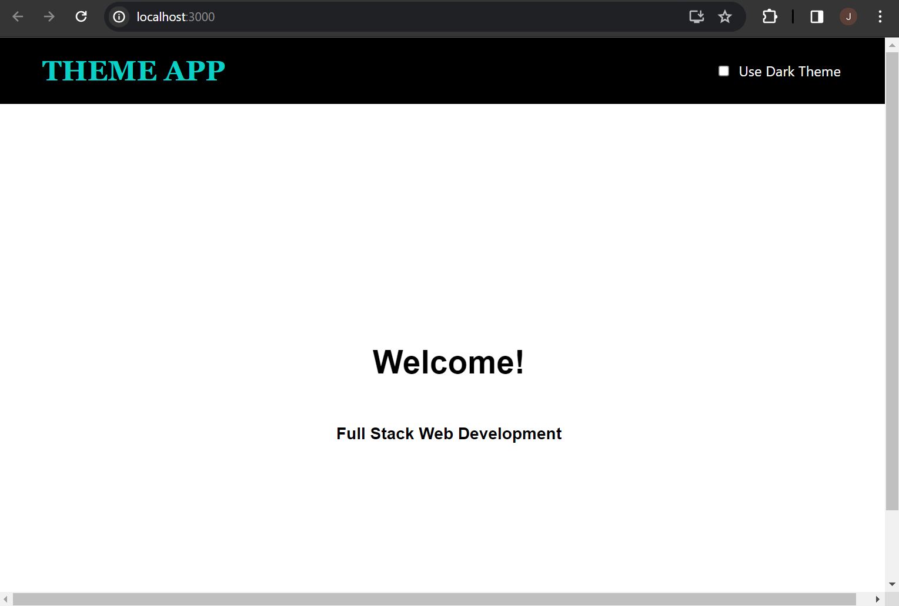
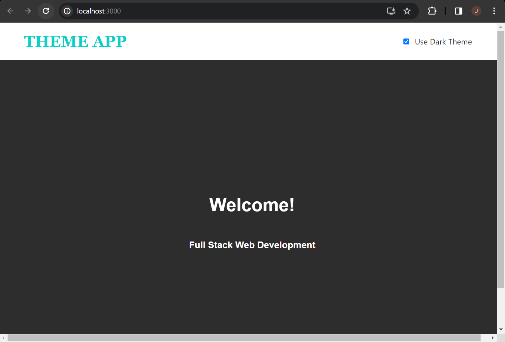

# web603-hw-w7d1

## Getting Started

Create the React app "theme-app" by 
```bash
$ npx create-react-app theme-app
```

Install the following dependencies by
```bash
$ npm install styled-components styled-theming redux react-redux @reduxjs/toolkit
```

## Test

After completing the code based on the instruction, you should be able to see:

### App Home (Default: Light Theme)


### App Home (Toggle Dark Theme)

